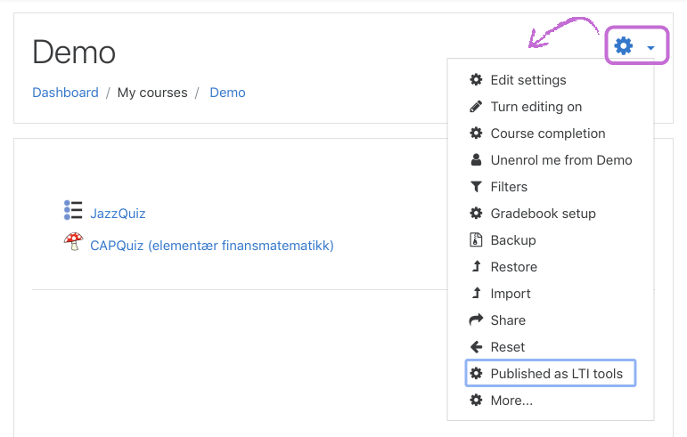
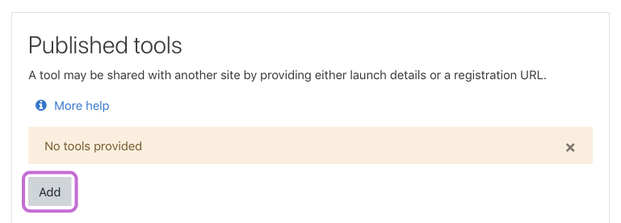
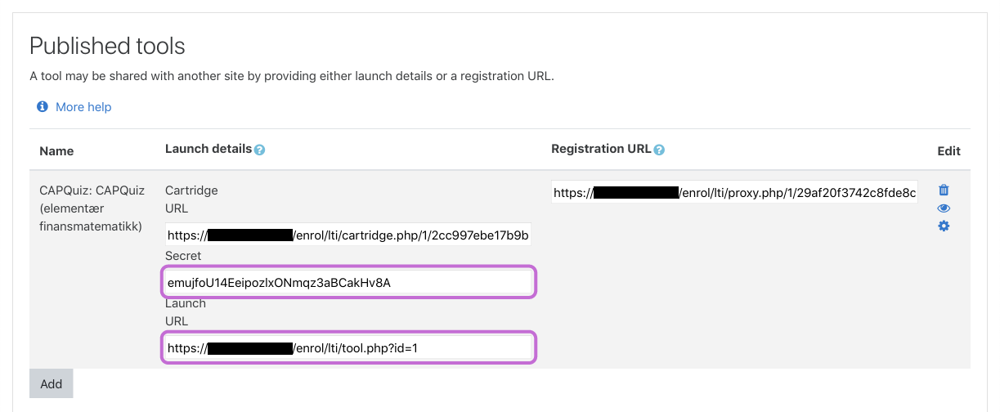
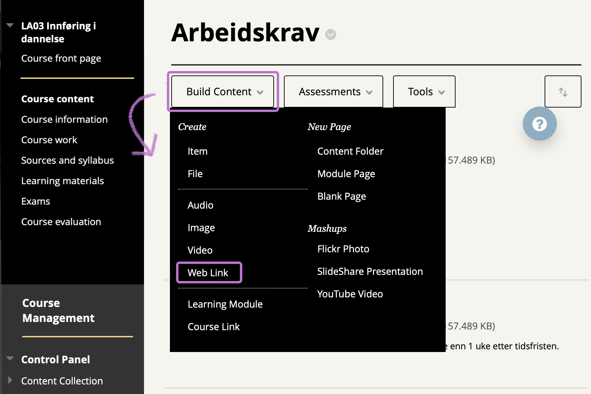
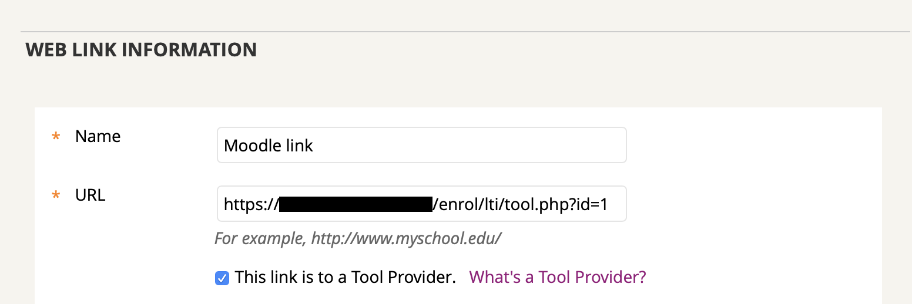
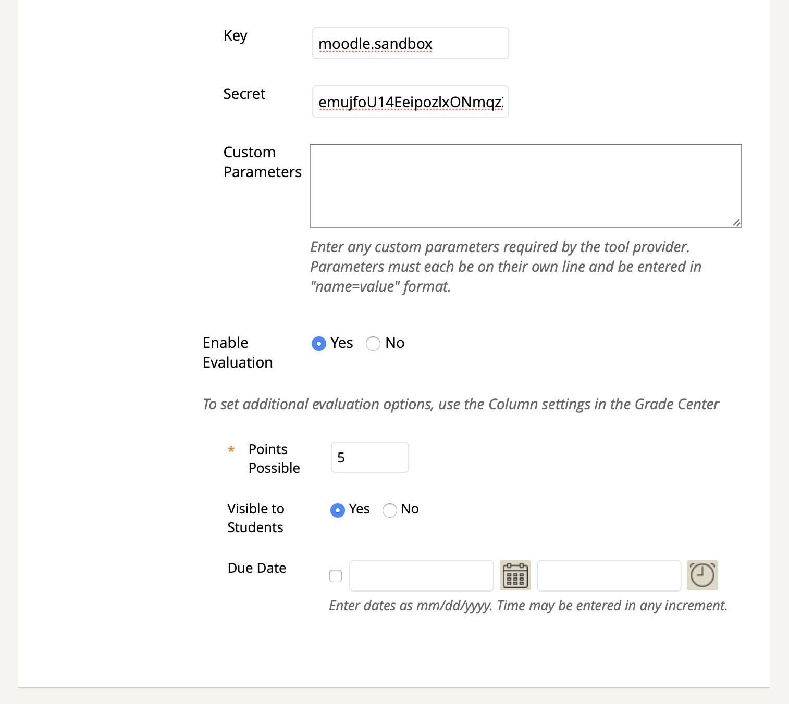

# Add Moodle integration in Blackboard
Blackboard has the capability of integrating a Moodle course or activity with the help of LTI. [Learning Tools Interoperability](https://www.imsglobal.org/activity/learning-tools-interoperability) (LTI) is a standard created by the [IMS Global Learning Consortium](https://www.imsglobal.org) that links content and resources to learning platforms.

## 1. Share access to a course or activity in Moodle
1. First you need to go to a course within Moodle.
2. Click on the `Actions menu` (the gear icon) in the upper right corner. Select the `Published as LTI tools`.

3. Click the 'Add method' button.

You will now be presented with a lot of options. However, you only need to configure a few of them.

4. In the `Tool to be published` dropdown, you can select which resource to publish/share. If you want to share the whole course, select `Course`. If you only want to share one particular activity, select it from the dropdown.
5. You can leave the other fields to default values and click the `Add method` button at the bottom of the form.

You will now see the published tool, along with some `URLs` and a `Secret`.

6. Make a note of the `Secret` and the `Launch URL`, as these will be used to authenticate access the tool later.

## 2. Integrate a Moodle course or activity with Blackboard
When you have shared access to a course or an activity, you need to link to this content in Blackboard.
1. First you need to go to a course within Blackboard. Enter a [content area](https://innsida.ntnu.no/wiki/-/wiki/English/Blackboard+-+Content+areas+and+menus+for+adding+content), for example **learning materials**.
2. Click on the **Build Content** button, and select **Web Link**.

3. Enter a **Name** for the resource. In the **URL** field, fill inn the URL obtained in step [1.6](Add-Moodle-integration-in-Blackboard-course#1-share-access-to-a-course-or-activity-in-moodle).

4. You then need to check the **This link is to a Tool Provider** checkbox.

If the URL in step [2.3](Add-Moodle-integration-in-Blackboard-course#2-integrate-a-moodle-course-or-activity-with-blackboard) is valid, you will be presented with a number of new fields.

5. In the **Key** field, enter any key you want. This can be thought of as a username used to authenticate access to the Moodle LTI Tool. If you provide the same key in another Web Link / LTI Tool, you will maintain progress/session in the external resource (reuses the user(s)).
6. Enter the **Secret** obtained in step [1.6](Add-Moodle-integration-in-Blackboard-course#1-share-access-to-a-course-or-activity-in-moodle).
7. If you would like to not show blocks for teachers, you can enter `force_embed = 1` into the **Custom Parameters** field. This may limit the functionality available to teachers and admins. To get blocks back, simply remove the parameter.
8. If you want to synchronize the grade obtained in the external course/activity, select **Yes** on **Enable Evaluation**.
   1. Enter the desired number of possible points in the **Points Possible** field.
   2. Select the appropriate radio button next to **Visible to Students**, according to whether or not you want to make the grade visible to students.
   3. If you want, you can set a due date. Select the checkbox next to **Due Date** and set a date and time in the respective fields.
9. You may want to add a description of the content in the **Description** field. You may also attach any file under **Attachments**.
10. Next to **Open in New Window** you may chose if you want to have the LTI activity opened in a now window or not (built in to Blackboard).
11. Finally, you might want to set date and time restrictions. This can be done under **Select Date and Time Restrictions**.