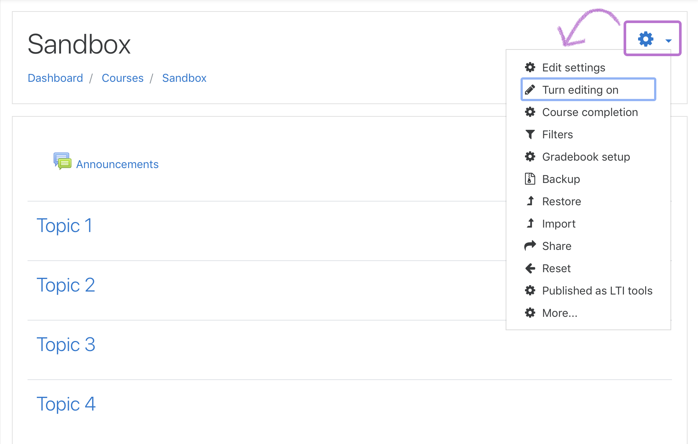
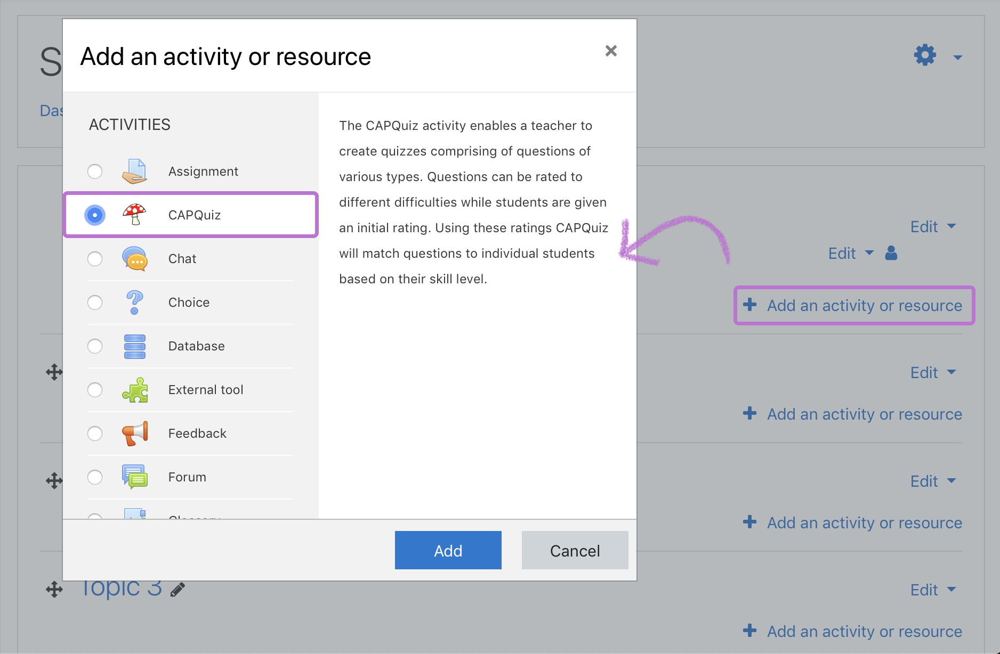
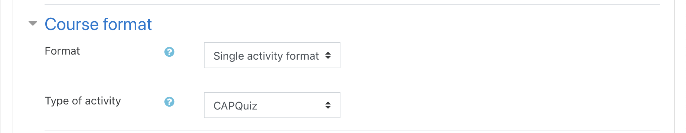

# Add an activity to a Moodle course
## 1. Add the activity to a course
1. Firstly, you need to go to a Moodle course.

2. Now, depending of the course format, different approaches should be taken:
### Topics format
1. If your course has a topics format, turn on editing mode by clicking on on the `Actions menu` (the gear icon) in the upper right corner. Select `Turn on editing mode`.

2. Click on the `Add an activity or resource` button.

3. Select the desired **activity** in the `Add an activity or resource` window.
4. Click the `Àdd` button.

### Single activity format
1. If you want to use a single activity format for your course, be sure that the wanted `activity` is selected in the dropdown next to the `Type of activity` setting. This is done in the `Edit course settings` page, under [Course format](https://docs.moodle.org/37/en/Course_settings#Format).

