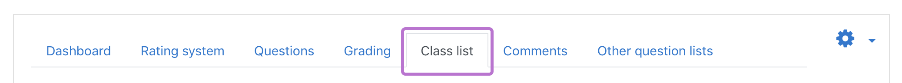

# Setup CAPQuiz for a Blackboard course
CAPQuiz is a computer adaptive practice activity module for Moodle. Through LTI it is possible to add this to Blackboard.

# 1. Setup CAPQuiz in a Moodle course.
1. The first thing you will need to do is to make sure CAPQuiz has been added to a Moodle course. These instructions can be found at [Add an activity to a Moodle course](Add-an-activity-to-a-Moodle-course).
2. You must complete the default setup of the CAPQuiz activity. Please refer to the [CAPQuiz documentation](https://github.com/KQMATH/moodle-mod_capquiz/wiki#where-to-start).

# 2. Add access to CAPQuiz in Blackboard course
Because CAPQuiz is a Moodle plugin, we have to make use of LTI in order to use CAPQuiz in Blackboard. In Blackboard, this access is made with a Blackboard `Web Link`. See [Add Moodle integration in Blackboard course](Add-Moodle-integration-in-Blackboard-course) for instructions on how to create this.

# 3. Blackboard specific configuration
CAPQuiz provides some functionalities witch might be a bit hard to understand and setup correctly with the integration to Blackboard. This is particularly tied to time limits and grading synchronization.

## Time limits and grading
Normally, you (the teacher) are mainly interested in whether a student has passed the activity within an eventual deadline. If you want a deadline, this should **only** be set in the CAPQuiz activity within Moodle. This is done by:
1. Go to the teacher interface in the CAPQuiz activity.
2. Click on the `Grading` tab.

3. Next to `Time for final grading`, fill in the wanted due date. Now, students (determined by the number of stars ⭐️) are only graded within the time-window specified by the `Time for final grading` setting. For more details on the grading in CAPQuiz, see [Grading](https://github.com/KQMATH/moodle-mod_capquiz/wiki/Grading).

If you want to give a student that has exceeded the deadline a passing grade you have to:
1. Access the teacher interface in the CAPQuiz activity.
2. Go to the `Class list` page and locate the student. Check hes current status, and determine if you want to approve him/her.

3. If you decide that you will give the student a passing grade, go back to Blackboard.
4. Go to the `Full Grade Center` and give the student a passing grade. For further details on the grade center, see [Blackboard - Overview of the grade center](https://innsida.ntnu.no/wiki/-/wiki/English/Blackboard+-+Overview+of+the+grade+center).